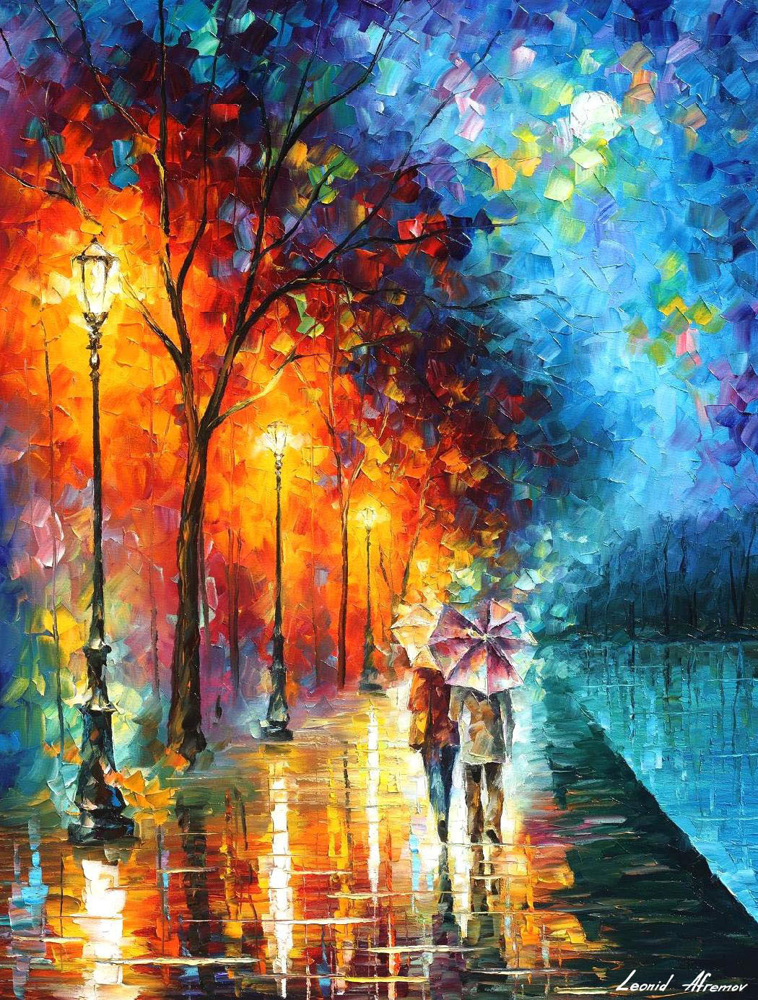

#StyleTransfer
Neural Style Transfer using convolutional autoencoders.

This is an implementation of the paper "Universal Style Transfer using Feature Transforms" https://arxiv.org/pdf/1705.08086.pdf

Some results:

Instructions for running:
Change the "StyleTransfer" function call in "test_stylize.py"(test_stylize.py)
Currently there are three different autoencoders trained which are of varying depths/no. of filters,
Level1 being the shallowest, Level3 being the deepest.

